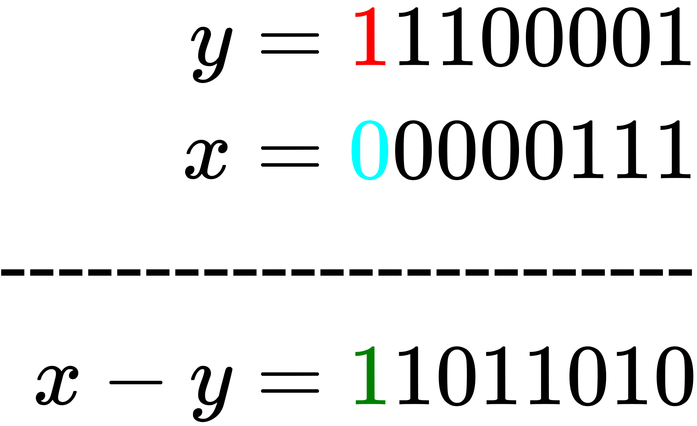

# Word Level Parallelism

<div align="right" style="text-align:right">
    <i>Okonda, Joseph L.</i>
    <br>
    <i>2021</i>
</div>

[![Crates.io][bp-crates-badge]][bp-crates-url] [![Documentation][bp-docs-badge]][bp-docs-url]

In this note, we shall explore a few bit level algorithms that we'll need when developing some of the specialized integer data structures. We begin by discussing a procedure that allows us to extract the first (the top) `k` bits of any integer in constant time. We then proceed to discuss procedures that allow us, in constant time, to operate on integers in parallel.

## Finding the `top(k)` bits of an integer

The first procedure is quite simple. The goal is, given a number `x` and a length `k`, to extract the first `k` bits of `x` in `O(1)`. A procedure that does this will be handy when implementing the x-fast trie.

```rust
const USIZE_BITS: usize = 64;
pub fn top_k_bits_of(x: usize, k: usize) -> usize {
    assert!(k != 0);
    let mut mask: usize = 1;

    // Shift the 1 to the index that is `k`
    // positions from the last index location.
    // That is `k` away from 64
    mask <<= USIZE_BITS - k;

    // Turn that one into a zero. And all
    // the other 63 zeros into ones. This
    // basically introduces a hole. in the next
    // step, we'll use this hole to trap a cascade
    // of carries
    mask = !mask;

    // I think this is the most interesting/entertaining part.
    // Adding a one triggers a cascade of carries that flip all
    // the bits (all ones) before the location of the zero from above into
    // zeros. The cascade stops when they reach the zero from
    // above. Since it is a zero, adding a 1 does not trigger a carry
    //
    // In the end, we have a mask where the top k bits are ones
    mask += 1;

    // This is straightforward
    x & mask
}
```

You can play around with the code so far [in the playground](https://play.rust-lang.org/?version=stable&mode=debug&edition=2018&gist=186242f8f5e9267430438fcb3119606c)

---

## Background

Arithmetic and logical operations take, for all intents and purposes, constant time. Such operations operate on whole words.  (A word is the size of a single memory segment. In this exposition, we assume a word size width of `64`. For a more in-depth discussion of computer memory, refer to [this note](https://akkadia.org/drepper/cpumemory.pdf)). For instance, it takes constant time to add two `64` bit numbers. The central idea of the methods we're about to discuss is this: If you have a bunch of small integers -- each smaller that sixty four bits, e.g. a bunch of bytes, we can pack many of them into a single sixty four bit integer. Then, we can operate on that packed integer as if it were a single number. For example, we can fit 8 byte sized numbers in a single word. By operating on the packed integer, we are in effect operating on 8 different integers in parallel. This is what we call `world level parallelism`. Of course there are intricate details that have been elided in this broad description. In the next sections, we take a detailed look at those details as we flesh out the different parallel operation.

## Motivation: B-Trees

Suppose we wish to maintain a set of small sized integers in a B-Tree. And suppose too that we wish to take advantage of the fact that we can fit many of these integers in a single, larger integer. How would we go about designing such a B-Tree?

Recall that a B-Tree of order `b` is a multiway search tree in which each node is a bucket that must contain between `b - 1` and `2b - 1` keys. Furthermore, each node has one more child than the number of keys it contains. That is, each node must have between `b` and `2b` child nodes. Operations on B-Trees rely on one key operation: `node.rank(x)`. This operation searches through the keys of a single node (which are sorted) and either returns the location of `x` in the bucket, or the index of the child we need to descend into in order to complete the operation at hand. In run of the mill B-Trees, `node.rank(x)` is implemented using binary search and thus takes `O(lg b)`. If we know that our keys are small integers, can we perform `node.rank(x)` in `O(1)`? It turns out we can. In the rest of this section, we start by building up the subroutines that we'll need in order to implement `O(1) node.rank(x)`. After that, we'll present the `O(1) node.rank(x)` procedure.

## Parallel Compare

The `node.rank(x)` operation depends on an even more basic operation: `compare(x, y)`. This operation simply tells us if `x >= y`. Suppose `x` and `y` are `7-bits` wide (but stored in an 8 byte integer such that the final bit is unoccupied), how could we implement `compare(x, y)`? Well, we could do it the `C-`way - by subtraction. However, instead of taking the usual route where we calculate `z = x - y` and if `z` is negative we know that `x < y` otherwise, we conclude that `x >= y`, we'll adopt a much cooler approach. In particular, we'll first set the 8th bit of `y`, the 7-bit number we are comparing against to `1`. We'll also set the 8th bit of `x` to 0. For example, suppose <!-- $x = 0000111 \text{ and } y = 1100001$ --> . Below, we show the effect of setting the 8th bit.

<!-- $$
\begin{aligned}
    y = 1100001 \rightarrow \textcolor{red}{1}1100001 \\
    x = 0000111 \rightarrow \textcolor{cyan}{0}0000111
\end{aligned}
$$ -->

<div align="center"></div>

Now, if we compute `y - x`, how will that 8th bit behave? Below, we show the result of this subtraction.

<!-- $$
\begin{aligned}
    y = \textcolor{red}{1}1100001 \\
    x = \textcolor{cyan}{0}0000111 \\
\text{------------------------} \\
    x - y = \textcolor{green}{1}1011010
\end{aligned}
$$ --> 

<div align="center"></div>

As shown above, when `y >= x` the sentinel bit in the result is turned on. Had `x` been larger than `y`, that bit would have been tuned off. Why does this happen? Well, it is a direct consequence of the borrowing that we have to do if the number we are subtracting from, `y` in this case is smaller that the amount we are subtracting (`x`). When we borrow, we'll eventually have to dip into the sentinel bit thus turning it off. To summarize, to compare two 7-bit integers, we set the 8-th bit to `0` in one of the numbers and to `1` in the other. We then subtract the resultant number and check the value of the `8-th` bit.

So far, we've been talking about how to compare `x` with a single `7bit` number. However, for our procedure to be useful subroutine in computing `node.rank(x)`, we need to compare `x` with `b` 7-bit numbers. Note that we should choose `b` such that it fits in 64 bits, so we choose `b=7`. That is, a single node holds 7, 7-bit numbers, each represented using 8 bits. If those seven numbers are organized such that each number has an associated sentinel bit that is set to `0`, we can compare `x` to all of them by comparing the entire word with a number formed by tiling `x` 7 times. Here is an example of seven small integers packed in a single machine word.
<!-- $$
\begin{aligned}
   _11101110_10101110_11111000_11001101_10101111_10001101_11110111_11100001\\
   _01010110_00111110_00111110_01000011_00011011_00101111_00100011_01111010
\end{aligned}
$$ -->

<div align="center"></div>

To recap, here is how we'd compare two collections of small integers in parallel:

- First, we pack the first collection, <!-- $x_1, x_2, \ldots x_n$ -->  into single machine word `X`, separating each integer with a sentinel bit set to `0`.
- Then we also pack the second collection of small integers , <!-- $y_1, y_2, \ldots y_n$ --> , into another machine word `Y`. However, this time, we separate each integer with a sentinel bit that is set to `1`.
- Then we calculate `X - Y`. The bit preceding `x_i, y_i` is `1` if `xᵢ ≥ yᵢ`

The scheme above leave two key questions unanswered. First, how do we perform the first and second steps, packing small integers into a single machine word? Can that be done in `O(1)`? Second, after we have done the subtraction, how do we read off the sentinel bits in order to get the actual comparison information that we need? Below, we address the first question. We shall come back to the second question shortly afterwards.

## Parallel Tile

When introducing this note, we asked how we could store a bunch of small numbers in a B-Tree, while taking advantage of the fact that our integers can be packed in a machine word. . We then realized that doing so would require us to find a routine that can find the rank of a number `x` in a given node in constant time. Thus far, we have found a rudimentary primitive, parallel compare, that allows us to compare many small integers in parallel. How would we use this primitive in our specialized B-Tree?

To use our primitive, we shall represent each node as a single machine word. That is, the bucket for each node will simply be a `64-bit` number. When storing a small integer into this bucket, we shall also prepend it with a `0`. That is, the keys in our bucket will be separated by sentinel bits set to `0`. Below, we introduce the abstraction for a single node in our B-Tree

```rust
/// The abstraction for a single node in our b-tree
/// that is specialized for holding small integers
/// that can be packed into a single machine word
#[derive(Debug, Default)]
pub struct SardineCan {
    /// The actual storage container
    buckets: u64,

    /// The count of items in this node.
    count: u8,
}

impl SardineCan {
    /// Procedure to store a single small integer in a given node
    /// Note that we do not handle the case where a can could be full.
    /// We ignore that because, ideally, this data structure would be part
    /// of a larger B-Tree implementation that would take care of such details
    pub fn add(&mut self, mut x: u8) {
        // Add the sentinel bit. It is set to 0
        x &= 0b0111_1111;

        // Make space in the bucket for the new item
        self.buckets <<= 8;

        // Add the new item into the bucket
        self.buckets  |= x as u64;

        // Increment the count of items
        self.count += 1;
    }   
}
```

We've seen how we're going to store our small integers in a single machine word. However, we've yet to fully answer the question of how to pack the integers though. Note that we only know how to pack when adding. How about when we have a single integer and we with to check if it's in the can? That is,  How to perform a lookup in a sardine can? To perform a lookup for the key `k`, we begin by replicating `k` seven times to form a number that is as wide as our can. Furthermore, we separate each small number in the packed integer using a sentinel bit that is set to 1. The act of forming the replicated number is known as tiling. How can we tile the query `k` in `O(1)`? We are going to use multiplication. The key insight comes from the observation that in base 10, multiplying a number by a multiplier that contains ones at specific locations has the effect of replicating that number. For instance, `8 * 11 = 88`, `8 * 101 = 808`, `8 * 1001001001001 = 8008008008008`, `125 * 10000010001 = 1250001250125`. We'd like to use this intuition to tile our query `k`. Before we do that, let's examine the multiplications we deed a bit more. Why does `8 * 111` produce `888`? It does so because:
<!-- $$
\begin{aligned}
   888 = (8 *10^2) + (8* 10^1) + (8 * 10^0)\\
   = (8 <<_{10} 2 ) + (8 <<_{10} 1) + (8 <<_{10} 0) \\
   = (800 + 080 + 008)
\end{aligned}
$$ --> 

<div align="center"></div>

Therefore, all we need to tile `k` is to find a multiplier that will have a similar effect to it. The logic below shows one such multiplier. it also includes an additional step where we set the sentinel spacer bits to 1.

```rust
impl SardineCan {
    pub fn parallel_tile(x: u8) -> u64 {
        // This carefully chosen multiplier will have the desired effect of replicating `x`
        // seven times, interspersing each instance of `x` with a 0
        let multiplier: u64 = 0b10000000_10000000_10000000_10000000_10000000_10000000_100000001;

        // Produce the provisional tiled number. We still need to set its
        // sentinel bits to 1
        let tiled_x = x as u64 * multiplier;

        // The bitmask to turn on  the sentinel bits
        let sentinel_mask: u64 = 0b10000000_10000000_10000000_10000000_10000000_10000000_1000000010000000;

        // Set the sentinel bits to 1 and return the tiled number
        tiled_x | sentinel_mask
    }
}
```

At this point, we are able to add small integers into a single node in our hypothetical B-Tree. We are also able to replicate a query `k` to form a number that is as large as the word size we're using. This means that we can do a parallel comparison via subtraction. After we perform the subtraction — subtracting the value stored in the can from our tiled key —, we'll be left with a number whose sentinel bits indicate whether the key is less than or equal to the associated small integer. To be more precise, the sentinel bit for a small integer in the difference will be 1 if the associated small integer is `<=` our key. The next thing we'd like to do is count how many values are `<=` our key. This is the rank of our key. We need to come up with a procedure that does this in `O(1)`. We'll explore that in the next section. Before moving on, feel free to check out the code thus far [here](https://play.rust-lang.org/?version=stable&mode=debug&edition=2018&gist=7688364fc546c19abc25f1a6264142dc)

## Parallel Rank

At this point, we can store tiny numbers in a given node and, when a key `x` comes in, we can tile it and perform the first step of a parallel comparison operation. To finish out the `node.rank(x)` operation, we need to discuss how to count up the number of items smaller than or equal to our key. To find this number, we simply need to count how many of the sentinel bits in the difference are set to `1`. We want to do this in `O(1)`. One option is to use a series of shifts to align all the sentinel bits, the adding them up. To perform the shifting in a single operation, we use the same idea we used when implementing `parallel_tile` — we multiply with a carefully chosen spreader. While this approach works well, we adopt a much simpler approach. After we have isolated the sentinel bits i the difference by performing a bitwise and with an appropriate mask, we simply call a rust built in procedure to count the number of ones.

```rust
impl SardineCan {
    /// Calculate how many items in this can are less than or
    /// equal to `x`
    pub fn parallel_rank(&self, x: u8) -> u8 {
        // Perform the parallel comparison
        let mut difference = Self::parallel_tile(x) - self.buckets;

        // Ultimately, we're only interested in whether the spacer sentinel bits
        // are turned on or off. In particular, we just need to know how many are
        // turned on. Here we use the mask from `parallel_tile` to isolate them
        let sentinel_mask: u64 = 0b10000000_10000000_10000000_10000000_10000000_10000000_1000000010000000;
        difference &= sentinel_mask;
        
        // There's an alternative method of counting up how many spacer bits are set to 1.
        // That method involves using a well chosen multiplier. To check it out look in 
        // at the `parallel_count` method below
        difference.count_ones() as u8
    }

    /// Counts up how many of the sentinel bits of `difference` are turned on.
    /// This could be used instead of using the builtin function `count_ones`.
    fn parallel_count(difference: u64) -> u8 {
        let stacker = 0b10000000_10000000_10000000_10000000_10000000_10000000_100000001u64;
        let mut stacked = difference as u128 * stacker as u128;
        stacked >>= 63;
        stacked &= 0b111;
        stacked as u8
    }
}
```

At this point, we have implemented all the (new) routines that would be needed to implement a B-Tree that uses a `SardineCan` as its node. If we were to implement such a tree, what would be the runtime of each dictionary operation? In a normal B-Tree, all these operations take on the order of <!-- $\mathcal{O}(\lg_b n * \lg_2 b) = O(\lg_2 n)$ -->  (Note, however, that when analyzing B-tree, we often only count the number of blocks that have to be read into memory and consider the time to search within a single block to be near constant). In a B-Tree that packs its keys using techniques discussed above, its runtime would be <!-- $\mathcal{O}(\lg_b n * 1) = O(\lg_b n)$ --> . Even more dramatically, its space usage will be <!-- $\Theta(\frac{n}{b})$ --> . Remember, we defined `b` as the number of small integers we could pack in a single machine word — `8` in our case.

[Here's a link](https://play.rust-lang.org/?version=stable&mode=debug&edition=2018&gist=9ea0b3715a46d728d9a815e6ce3d9597) to all the methods we've implemented so far.

---

## `O(1)` Most Significant Bit

When we talk of the most significant bit of a number, we're often referring to the 0-indexed location of the highest bit set. Note that this is a more general problem than simply finding the number that would be formed if only the `msb` were set. For instance, `MSB(010010001)` is `7` and not `128`.

The simplest method for finding this index in by doing a linear scan over the bits of the number in question while keeping a count of the number of bits seen thus far. This scheme runs in `O(lg n)` where `n` is the highest number our function may operate on.

```rust
/// A procedure for finding the index of the most significant
/// bit in time linear to the number of bits used
/// to represent the value.
fn get_msb_idx_of(query: u64) -> u8 {
    for i in (0..64).rev() {
        if query & (1 << i) != 0 {
            return i;
        }
    }
    panic!("MSB(0) is undefined")
}
```

We can improve upon the linear scanning procedure using bit level binary search. This brings down the running time to `O(lg lg n)`. Often, however, when we know that we'll be doing many `msb` queries, we use a lookup table to compute this value. This is the solution we adopted when discussing sparse tables in the context of [the range min query problem](./rmq.md#querying-the-sparse-table). Using that method, we're able to locate the index of the highest bit set in constant  `O(1)` time, albeit with an added preprocessing step to build the lookup table. The question we seek to answer in this section is, can we locate the index of the most significant bit in constant time without using a lookup table?

### The MSB(x)-Rank(x) Equivalence

As a reminder, `MSB(x)` is the largest value of `k` such that <!-- $2^k \leq x$ --> . Remember also the definition of `Rank(x)`: it is the number of items, in some underlying ordered collection, that are less than or equal to `x`. Immediately, we can see how eerily similar these two definitions are. In fact, we can redefine `MSB(x)` in terms of `Rank(x)` by choosing an appropriate underlying collection. If the underlying collection is a list of all the powers of two, <!-- $\left<2^0, 2^1, 2^2, \ldots 2^{62}, 2^{63}\right>$ --> , then `MSB(x)` is the same as `Rank(x)` in that array.

### Parallel Pack

At this point, we're one step closer to the solution. We've redefined `MSB` as `Rank` and we have a method for solving `Rank` in constant time — `parallel_rank`. That procedure, however, assumes that the underlying array can be packed in a single machine word. It also assumes that our query `x` is as wide as our packed underlying array. Clearly, we cannot fit `64` numbers is a single machine word. However, if we can somehow reduce the size of our query, then, maybe, we can reduce the size of the needed underlying array. To do that, we'll borrow a technique that we saw extensively while discussing [the median of medians method](https://github.com/jlikhuva/blog/blob/main/posts/rmq.md#the-method-of-four-russians): Block Decomposition.

We'll decompose the bits of our query into blocks of `8` bits. This means that the underlying array of powers of two will only have `8` elements down from `64`. This still won't fit in a single machine word – remember that when discussing `parallel_rank`, we assumed that our numbers had only `7 bits`. Nevertheless, we can still pack our 8-bit numbers in two machine words (`u128` instead of `u64`) without affecting the runtime of `parallel_rank`. One final piece of the puzzle still remains. How will we know which block to focus on? We need some sort of routing information.

For routing, we'll keep a secondary 8-bit array with one entry for each block. The `k-th` entry of this array contains a `1` if and only if the `k-th` block of our query has a numeric value greater than zero (that is, the block contains a `1` anywhere within it). Note that the size of this secondary bit array is small enough that we can pack it into a few machine words. This means that we can leverage our previous methods when operating on it.

To recapitulate: To answer `MSB(x)`, we'll

1. Decompose the bit representation of `x` into blocks of 8 bits.
2. We'll also form a secondary bit array with as many bits as the number of blocks we have. In this secondary array, the `k-th` bit will be on when the `k-th` block could conceivably have a most significant bit.
3. Finally, to find `MSB(x)`, we'll first use  `parallel_rank` to find the index of the most significant bit in the secondary routing array. This will tell us the location of the most significant block. We shall then use `parallel_rank` one more time to find the index of the most significant bit in the most significant block.

We implement this three step procedure below. We begin by defining a simple abstraction.

```rust
#[derive(Debug)]
struct FourRussiansMSB {
    /// The secondary routing bit array
    macro_bit_array: u8,

    /// This is simply the number whose `msb` we'd like to find.
    /// It is logically split into blocks of 8 bits
    micro_arrays: u64,
}
```

Then, we implement procedures to build the two-level structure. Most of these methods use ideas that we already discussed in previous sections.

```rust
 impl FourRussiansMSB {
        pub fn build(query: u64) -> Self {
            let macro_bit_array = Self::generate_macro_bit_array(query);
            FourRussiansMSB {
                macro_bit_array,
                micro_arrays: query,
            }
        }

        /// Generates the routing macro array. To do so, it
        /// relies on the observation that a block contains a
        /// 1 bit if it's highest bit is a 1 or if its
        /// lower 7 bits' numeric value is greater than 0.
        fn generate_macro_bit_array(query: u64) -> u8 {
            // The first step is to extract information about the highest bit in each block.
            let high_bit_mask = 0b10000000_10000000_10000000_10000000_10000000_10000000_10000000_10000000u64;
            let is_high_bit_set = query & high_bit_mask;

            // The second step is to extract information about the lower seven bits
            // in each block. To do so, we use parallel_compare, which is basically
            // subtraction.
            let packed_ones = 0b00000001_00000001_00000001_00000001_00000001_00000001_00000001_00000001u64;
            let mut are_lower_bits_set = query | high_bit_mask;
            are_lower_bits_set -= packed_ones;
            are_lower_bits_set &= high_bit_mask;

            // We unify the information from the first two steps into a single value
            // that tells us if a block could conceivably contain the MSB
            let is_block_active = is_high_bit_set | are_lower_bits_set;

            // To generate the macro array, we need to form an 8-bit number out of the
            // per-block highest bits from the last step. To pack them together, we simply use
            // an appropriate multiplier which does the work of a series of bitshifts
            let packer = 0b10000001_00000010_00000100_00001000_00010000_00100000_010000001u64;
            let mut macro_bit_array = is_block_active as u128 * packer as u128;
            macro_bit_array >>= 49;
            if is_block_active >> 56 == 0 {
                macro_bit_array &= 0b0111_1111;
            } else {
                macro_bit_array |= 0b1000_0000;
                macro_bit_array &= 0b1111_1111;
            }
            macro_bit_array as u8
        }

        pub fn get_msb(&self) -> u8 {
            let block_id = self.msb_by_rank(self.macro_bit_array);
            let block_start = (block_id - 1) * 8;
            let msb_block = self.get_msb_block(block_start);
            let msb = self.msb_by_rank(msb_block);
            let in_block_location = msb - 1;
            block_start + in_block_location
        }

        /// Given a block id -- which is the msb value in the macro routing array,
        /// this method retrieves the 8 bits that represent that block
        /// from the `micro_arrays`. `block_id 0 refers to the highest
        fn get_msb_block(&self, block_start: u8) -> u8 {
            let block_mask = 0b1111_1111u64;
            let mut block = self.micro_arrays >> block_start;
            block &= block_mask;
            block as u8
        }

        /// Finds the index of the most significant bit in the
        /// provided 8-bit number by finding its rank among the
        /// 8 possible powers of 2: <1, 2, 4, 8, 16, 32, 64, 128>.
        /// To do so in constant time, it employs techniques from
        /// our discussion of `parallel_rank`
        fn msb_by_rank(&self, query: u8) -> u8 {
            // Perform the parallel comparison
            let tiled_query = Self::parallel_tile_128(query);
            let packed_keys = 0b000000001_000000010_000000100_000001000_000010000_000100000_001000000_010000000u128;
            let mut difference =  tiled_query - packed_keys;

            // Isolate the spacer sentinel bits
            let sentinel_mask = 0b100000000_100000000_100000000_100000000_100000000_100000000_100000000_100000000u128;
            difference &= sentinel_mask;

            // Count the number of spacer bits that are turned on
            difference.count_ones() as u8
        }

        /// Produces a number that is a result of replicating the query
        /// eight times. This uses 72 bits of space.
        pub fn parallel_tile_128(query: u8) -> u128 {
            let multiplier = 0b100000000_100000000_100000000_100000000_100000000_100000000_100000000_1000000001u128;

            // Produce the provisional tiled number. We still need to set its
            // sentinel bits to 1
            let tiled_query = query as u128 * multiplier;

            // The bitmask to turn on  the sentinel bits
            let sentinel_mask = 0b100000000_100000000_100000000_100000000_100000000_100000000_100000000_100000000u128;

            // Set the sentinel bits to 1 and return the tiled number
            tiled_query | sentinel_mask
        }
    }
}
```

With the abstractions above, implementing `MSB(x)` is as simple as:

```rust
pub fn get_msb_idx_of(query: u64) -> u8 {
    FourRussiansMSB::build(query).get_msb()
}
```

### `O(1) LCP(x, y)`

The bit version of the LCP asks us to find the length of the longest common prefix between the bit-strings of the two numbers. This can simply be solved by leveraging our `O(1) MSB(n)` procedure from above.

```rust
pub fn lcp_len_of(a: u64, b: u64) -> u64 {
    63 - get_msb_idx_of(a ^ b) as u64
}
```

[Here's a link to all the functions we've implemented.](https://play.rust-lang.org/?version=stable&mode=debug&edition=2018&gist=4c4975e8474c28d53c35abbe2feb1977)

## References

1. [CS 166 Lecture 15](http://web.stanford.edu/class/archive/cs/cs166/cs166.1196/lectures/15/Slides15.pdf)
2. [CS 166 Lecture 16](http://web.stanford.edu/class/archive/cs/cs166/cs166.1196/lectures/16/Slides16.pdf)
3. [CS 166 Lecture 17](http://web.stanford.edu/class/archive/cs/cs166/cs166.1196/lectures/17/Slides17.pdf)
4. [6.851](http://courses.csail.mit.edu/6.851/fall17/scribe/lec12.pdf)
5. [The Original Fusion Tree Paper](https://reader.elsevier.com/reader/sd/pii/0022000093900404?token=1610EF62181DAC974715067B85459A4709A9BC64E39827CE0369C6C8E18540DFD1DBAD38BEE35BFF95C4C05E45A1D1D5)
6. [This StackOverflow Question. Scroll down until you find the answer by user `templatetypedef`](https://stackoverflow.com/questions/3878320/understanding-fusion-trees)

[bp-crates-badge]: https://img.shields.io/crates/v/bit-parallelism.svg?style=for-the-badge&logo=rust
[bp-crates-url]: https://crates.io/crates/bit-parallelism
[bp-docs-badge]: https://img.shields.io/docsrs/bit-parallelism/latest?style=for-the-badge&logo=docs.rs
[bp-docs-url]: https://docs.rs/bit-parallelism
