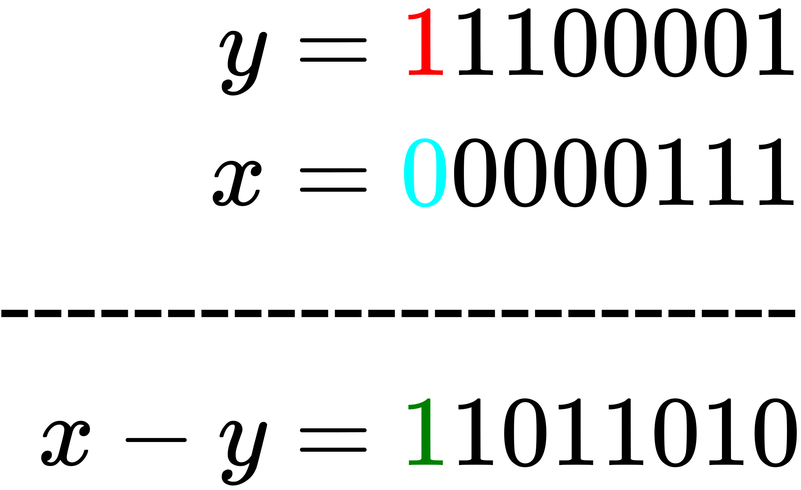

# Word Level Parallelism

In this note, we shall explore a few bit level algorithms that we'll need when developing some of the specialized integer data structures. We begin by discussing a procedure that allows us to extract the first (the top) `k` bits of any integer in constant time. We then proceed to discuss procedures that allow us, in constant time, to operate on integers in parallel.

## Finding the `top(k)` bits of an integer

The first procedure is quite simple. The goal is, given a number `x` and a length `k`, to extract the first `k` bits of `x` in `O(1)`. A procedure that does this will be handy when implementing the x-fast trie. Below, we implement this procedure.

```rust
const USIZE_BITS: usize = 64;
pub fn top_k_bits_of(x: usize, k: usize) -> usize {
    assert!(k != 0);
    let mut mask: usize = 1;

    // Shift the 1 to the index that is `k`
    // positions from the last index location.
    // That is `k` away from 64
    mask <<= USIZE_BITS - k;

    // Turn that one into a zero. And all
    // the other 63 zeros into ones. This
    // basically introduces a hole. in the next
    // step, we'll use this hole to trap a cascade
    // of carries
    mask = !mask;

    // I think this is the most interesting/entertaining part.
    // Adding a one triggers a cascade of carries that flip all
    // the bits (all ones) before the location of the zero from above into
    // zeros. The cascade stops when they reach the zero from
    // above. Since it is a zero, adding a 1 does not trigger a carry
    //
    // In the end, we have a mask where the top k bits are ones
    mask += 1;

    // This is straightforward
    x & mask
}
```

You can play around with the code so far [in the playground](https://play.rust-lang.org/?version=stable&mode=debug&edition=2018&gist=186242f8f5e9267430438fcb3119606c)

## Background

Arithmetic and logical operations take, for all intents and purposes, constant time. Such operations operate on whole words.  (A word is the size of a single memory segment. In this exposition, we assume a word size width of `64`. For a more in-depth discussion of computer memory, refer to [this note](https://akkadia.org/drepper/cpumemory.pdf)). For instance, it takes constant time to add two `64` bit numbers. The central idea of the methods we're about to discuss is this: If you have a bunch of small integers -- each smaller that sixty four bits, e.g. a bunch of bytes, we can pack many of them into a single sixty four bit integer. Then, we can operate on that packed integer as if it were a single number. For example, we can fit 8 byte sized numbers in a single word. By operating on the packed integer, we are in effect operating on 8 different integers in parallel. This is what we call world level parallelism. Of course there are intricate details that have been elided, in this broad description. In the next sections, we take a detailed look at those details as we flesh out the different parallel operation.

## Motivation: B-Trees

Suppose we wish to maintain a set of small sized integers in a B-Tree. And suppose too that we wish to take advantage of the fact that we can fit many of these integers in a single, larger integer. How would we go about designing such a B-Tree?

Recall that a B-Tree of order `b` is a multiway search tree in which each node is a bucket that must contain between `b - 1` and `2b - 1` keys. Furthermore, each node has one more child than the number of keys it contains. That is, each node must have between `b` and `2b` child nodes. Operations on B-Trees rely on a key operation: `node.rank(x)`. This operation searches through the keys of a single node (which are sorted) and either returns the location of `x` in the bucket, or the index of the child we need to descend into in order to complete the operation at hand. In run of the mill B-Trees, `node.rank(x)` is implemented using binary search and thus takes `O(lg b)`. If we know that our keys are small integers, can we perform `node.rank(x)` in `O(1)`? It turns out we can. Let's see how.

## Parallel Compare

The `node.rank(x)` operation depends on an even more basic operation: `compare(x, y)`. This operation simply tells us if `x >= y`. Suppose `x` and `y` are `7-bits` wide (but stored in an 8 byte integer such that the final bit is unoccupied), how could we implement `compare(x, y)`? Well, we could do it the `C-`way - by subtraction. However, instead of taking the usual route where we calculate `z = x - y` and if `z` is negative we know that `x < y` otherwise, we conclude that `x >= y`, we'll adopt a much cooler approach. In particular, we'll first set the 8th bit of `y`, the 7-bit number we are comparing against to `1`. We'll also set the 8th bit of `x` to 0. For example, suppose <!-- $x = 0000111 \text{ and } y = 1100001$ --> . Below, we show the effect of setting the 8th bit.

<!-- $$
\begin{aligned}
    y = 1100001 \rightarrow \textcolor{red}{1}1100001 \\
    x = 0000111 \rightarrow \textcolor{cyan}{0}0000111
\end{aligned}
$$ -->

<div align="center"></div>

Now, if we compute `y - x`, how will that 8th bit behave? Below, we show the result of this subtraction.

<!-- $$
\begin{aligned}
    y = \textcolor{red}{1}1100001 \\
    x = \textcolor{cyan}{0}0000111 \\
\text{------------------------} \\
    x - y = \textcolor{green}{1}1011010
\end{aligned}
$$ --> 

<div align="center"></div>

As shown above, when `y >= x` the sentinel bit in the result is turned on. Had `x` been larger than `y`, that bit would have been tuned off. Why does this happen? Well, it is a direct consequence of the borrowing that we have to do if the number we are subtracting from, `y` in this case is smaller that the amount we are subtracting (`x`). When we borrow, we'll eventually have to dip into the sentinel bit thus turning it off. To summarize, to compare two 7-bit integers, we set the 8-th bit to `0` in one of the numbers and to `1` in the other. We then subtract the resultant number and check the value of the `8-th` bit.

So far, we've been talking about how to compare `x` with a single `7bit` number. However, for our procedure to be useful subroutine in computing `node.rank(x)`, we need to compare `x` with `b` 7-bit numbers. Note that we should choose `b` such that it fits in 64 bits, so we choose `b=7`. That is, a single node holds 7, 7-bit numbers, each represented using 8 bits. If those seven numbers are organized such that each number has an associated sentinel bit that is set to `0`, we can compare `x` to all of them by comparing the entire word with a number formed by tiling `x` 7 times. Here is an example of seven small integers packed in a single machine word.
<!-- $$
\begin{aligned}
   _11101110_10101110_11111000_11001101_10101111_10001101_11110111_11100001\\
   _01010110_00111110_00111110_01000011_00011011_00101111_00100011_01111010
\end{aligned}
$$ -->

<div align="center"></div>

To recap, here is how we'd compare two collections of small integers in parallel:

- First, we pack the first collection, <!-- $x_1, x_2, \ldots x_n$ -->  into single machine word `X`, separating each integer with a sentinel bit set to `0`.
- Then we also pack the second collection of small integers , <!-- $y_1, y_2, \ldots y_n$ --> , into another machine word `Y`. However, this time, we separate each integer with a sentinel bit that is set to `1`.
- Then we calculate `X - Y`. The bit preceding `x_i, y_i` is `1` if `xᵢ ≥ yᵢ`

The scheme above leave two key questions unanswered. First, how do we perform the first and second steps, packing small integers into a single machine word? Can that be done in `O(1)`? Second, after we have done the subtraction, how do we read off the sentinel bits in order to get the actual comparison information that we need? Below, we address the first question. We shall come back to the second question shortly afterwards.

## Parallel Tile

When introducing this note, we asked how we could store a bunch of small numbers in a B-Tree, while taking advantage of the fact that our integers can be packed in a machine word. . We then realized that doing so would require us to find a routine that can find the rank of a number `x` in a given node in constant time. Thus far, we have found a rudimentary primitive, parallel compare, that allows us to compare many small integers in parallel. How would we use this primitive in our specialized B-Tree?

To use our primitive, we shall represent each node as a single machine word. That is, the bucket for each node will simply be a `64-bit` number. When storing a small integer into this bucket, we shall also prepend it with a `0`. That is, the keys in our bucket will be separated by sentinel bits set to `0`. Below, we introduce the abstraction for a single node in our B-Tree

```rust
/// The abstraction for a single node in our b-tree
/// that is specialized for holding small integers
/// that can be packed into a single machine word
#[derive(Debug, Default)]
pub struct SardineCan {
    /// The actual storage container
    buckets: u64,

    /// The count of items in this node.
    count: u8,
}

impl SardineCan {
    /// Procedure to store a single small integer in a given node
    /// Note that we do not handle the case where a can could be full.
    /// We ignore that because, ideally, this data structure would be part
    /// of a larger B-Tree implementation that would take care of such details
    pub fn add(&mut self, mut x: u8) {
        // Add the sentinel bit. It is set to 0
        x &= 0b0111_1111;

        // Make space in the bucket for the new item
        self.buckets <<= 8;

        // Add the new item into the bucket
        self.buckets  |= x as u64;

        // Increment the count of items
        self.count += 1;
    }   
}
```

We've seen how we're going to store our small integers in a single machine word. However, we've yet to fully answer the question of how to pack the integers though. Note that we only know how to pack when adding. How about when we have a single integer and we with to check if it's in the can? That is,  How to perform a lookup in a sardine can? To perform a lookup for the key `k`, we begin by replicating `k` seven times to form a number that is as wide as our can. Furthermore, we separate each small number in the packed integer using a sentinel bit that is set to 1. The act of forming the replicated number is known as tiling. How can we tile the query `k` in `O(1)`? We are going to use multiplication. The key insight comes from the observation that in base 10, multiplying a number by a multiplier that contains ones at specific locations has the effect of replicating that number. For instance, `8 * 11 = 88`, `8 * 101 = 808`, `8 * 1001001001001 = 8008008008008`, `125 * 10000010001 = 1250001250125`. We'd like to use this intuition to tile our query `k`. Before we do that, let's examine the multiplications we deed a bit more. Why does `8 * 111` produce `888`? It does so because:
<!-- $$
\begin{aligned}
   888 = (8 *10^2) + (8* 10^1) + (8 * 10^0)\\
   = (8 <<_{10} 2 ) + (8 <<_{10} 1) + (8 <<_{10} 0) \\
   = (800 + 080 + 008)
\end{aligned}
$$ --> 

<div align="center"></div>

Therefore, all we need to tile `k` is to find a multiplier that will have a similar effect to it. The logic below shows one such multiplier. it also includes an additional step where we set the sentinel spacer bits to 1.

```rust
impl SardineCan {
    pub fn parallel_tile(x: u8) -> u64 {
        // This carefully chosen multiplier will have the desired effect of replicating `x`
        // seven times, interspersing each instance of `x` with a 0
        let multiplier: u64 = 0b10000000_10000000_10000000_10000000_10000000_10000000_100000001;

        // Produce the provisional tiled number. We still need to set its
        // sentinel bits to 1
        let tiled_x = x as u64 * multiplier;

        // The bitmask to turn on  the sentinel bits
        let sentinel_mask: u64 = 0b10000000_10000000_10000000_10000000_10000000_10000000_1000000010000000;

        // Set the sentinel bits to 1 and return the tiled number
        tiled_x | sentinel_mask
    }
}
```

At this point, we are able to add small integers into a single node in our hypothetical B-Tree. We are also able to replicate a query `k` to form a number that is as large as the word size we're using. This means that we can do a parallel comparison via subtraction. After we perform the subtraction — subtracting the value stored in the can from our tiled key —, we'll be left with a number whose sentinel bits indicate whether the key is less than or equal to the associated small integer. To be more precise, the sentinel bit for a small integer in the difference will be 1 if the associated small integer is `<=` our key. The next thing we'd like to do is count how many values are `<=` our key. This is the rank of our key. We need to come up with a procedure that does this in `O(1)`. We'll explore that in the next section. Before moving on, feel free to check out the code thus far [here](https://play.rust-lang.org/?version=stable&mode=debug&edition=2018&gist=7688364fc546c19abc25f1a6264142dc)

## Parallel Rank

Define rank. With rank, we first compare, then descend. In a b-tree the cost of searching within the nodes dominates `O(logb n · log b) = O(log n)`.. If we can fit all the keys in a node into O(1)
machine words, we can determine rank(k) in time O(1)
for total lookup cost of `O(logb n)`.

## Parallel Add

After performing our subtraction, we’re left with a
number like this one, where the highlighted bits
are “interesting” to us.
Goal: Add up these “interesting” values using
O(1) word operations.

This is a series of shifts and
adds. It’s equivalent to
multiplying our original
number by some well-chosen
spreader!

## `O(1)` Most Significant Bit

Mathematically, msb(n) is the largest value of k
such that 2k ≤ n. 
There’s a simple O(w)-time algorithm
We can improve this runtime to O(log w) by using a
binary search:
Lookup table

## Parallel Pack

## `O(1)` Integer LCP

- Given two integers m and n, the longest common
prefix of m and n, denoted lcp(m, n), is the length
of the longest bitstring they both start with.
- 63 - msb(m ⊕ n)

https://rust-lang.github.io/api-guidelines/type-safety.html#newtypes-provide-static-distinctions-c-newtype

## References

1. [CS 166 Lecture 15](http://web.stanford.edu/class/archive/cs/cs166/cs166.1196/lectures/15/Slides15.pdf)
2. [CS 166 Lecture 16](http://web.stanford.edu/class/archive/cs/cs166/cs166.1196/lectures/16/Slides16.pdf)
3. [CS 166 Lecture 17](http://web.stanford.edu/class/archive/cs/cs166/cs166.1196/lectures/17/Slides17.pdf)
4. [6.851](http://courses.csail.mit.edu/6.851/fall17/scribe/lec12.pdf)